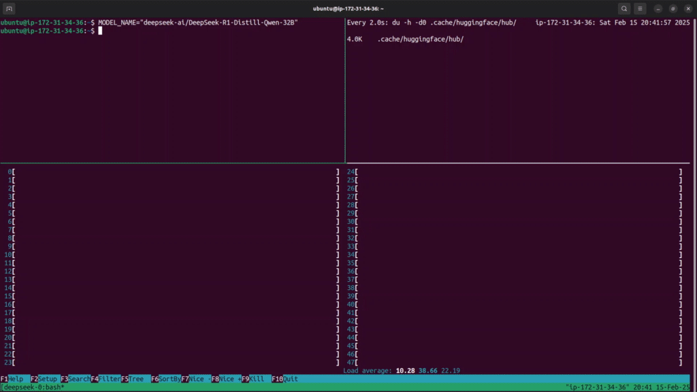

## Run DeepSeek on AWS


In this repo, I will share my experiences of running one of the DeepSeek open-weights models (DeepSeek-R1-Distill-Qwen-32B)
directly on AWS hardware in the cloud - no need for API tokens. 

The good news is that it's easier than you think - modern libraries, such as PyTorch and the Hugging Face (🤗) transformers
package, facilitate much of the heavy lifting. I found some extra tips and tricks along the way to speed things up and I 
will share these with you in this post.  

This work is part of a larger, experimental AI-for-good project that I'm working on, that I hope to share in due course. 
I hope that documenting this part of that setup will be benefit practitioners who are looking to run similar models on 
big hardware.

You can see an example of how to generate with DeepSeek from a cloud terminal in the screen recording above 
(8x speed up).

Hit the ⭐ button if you've enjoyed reading this technical article! 

You can also read this article on the ZL Labs [website](https://zl-labs.tech/post/2025-02-15-run-deepseek/).

### Overview

To get DeepSeek R1 (distilled onto Qwen-32B-Instruct) running on AWS, follow his is a multi-step process:

   1. [Rent](#step-1-rent-hardware) hardware (on AWS in my case).
      1. Optional: [Build](#appendix-step-1a---build-ami) an AMI snapshot with NVIDIA drivers (see Appendix), or use a pre-built one.
   2. [Download](#step-2-download-model) the model using Hugging Face CLI.
      1. Downloading the weights is parallelized and lightning fast with `HF_TRANSFER`.
   3. [Generate](#step-3-run-deepseek) from the LLM using [PyTorch](https://pytorch.org/) and the [`transformers`](https://pypi.org/project/transformers/) library. 


### Why DeepSeek?

DeepSeek is the large language model (LLM) currently making waves in the AI space. The R1 family of models in particular
shows very strong performance[^1] across a range of reasoning benchmarks (such as MMLU and AIME), as compared to popular 
closed-source models (OpenAI's o1, Claude 3.5-Sonnet).

[^1]: https://www.deeplearning.ai/the-batch/deepseek-r1-an-affordable-rival-to-openais-o1/

In addition, DeepSeek (the company) have open-sourced the model weights on the Hugging Face model hub, which makes it
accessible to anyone with the hardware to run it. This article will show one way that this can be done - in our case, 
using the AWS cloud infrastructure.


### Step 1: Rent Hardware

[](/image/runds-launch-instance.png)


Renting hardware on AWS is most easily done by clicking 'Launch Instance' in the EC2 section of the AWS console.
This allows you to choose your setup, including the instance type, disk size, and network settings. 

One of the first things you need to do is choose your AMI. The [Appendix](#appendix-step-1a---build-ami) will walk you through 
how to build your own one, with NVIDIA drivers and PyTorch dependencies pre-installed. Feel free to choose an AWS default 
one if that suits you better.

For the instance type, ultimately we're going to need a multi-GPU instance: I recommend the `g5.12xlarge` for this
exercise, which comes with 4x NVIDIA A10G GPUs, enough to accelerate the 32-billion-parameter model.

💡 _Remember_: if you are going to build your own custom AMI (like I do in the Appendix), it is wiser to do that part on 
a lower-tier instance, such as `g5.xlarge`, as they are typically about 5x cheaper. You can re-use that AMI snapshot on 
higher-tier hardware.


[](/image/runds-launch-instance-detail2.png)

Summary of chosen hardware: 

- Instance type: g5.12xlarge, which comes with:
  - vCPUs: 48;
  - GPUs: 4x NVIDIA A10G;
  - VRAM: 96GB (24GB per GPU).
- Disk size: choose 100GB (the default won't be enough!)
- Approximate cost: \$5-7 per hour (on-demand) or \$2-3 (spot), at time of writing.
- AMI: custom-built with NVIDIA drivers - see the [Appendix](#appendix-step-1a---build-ami).


After that you'll need to set up a security key, such as a PEM file, in order to SSH into the instance (on AWS, it's
called "Key pair (login)"). If you've created one before, you can re-use it. If not, you can create a new one in the AWS 
 console and then copy it to your local `$HOME` directory, or a dedicated SSH one. 
In addition, you should also set up a security group to allow SSH access from your IP address only (see "Network settings").

💡 _Tip_: When you're setting up this instance, ensure that you set your security group to only allow your IP address.
That will allow you to enable a public IP address on which to reach the instance via SSH.

Finally, add some EBS disk storage (see "Configure storage"). For this exercise, I recommend _100GB_, as the 
model weights take up more than 60GB, and you'll need some for dependencies and application storage.

Once you've launched the instance, you can access with an `ssh` command similar to this:

```bash
ssh -A -i ~/<PEMKEY>.pem ubuntu@<EC2_PUBLIC_IP>
```


### Step 2: Download Model

[Code](https://github.com/lukerm/run-deepseek/blob/b8681431946fe830ad5aa45ae76428603ec7a097/src/download_deepseek.sh)



After digging around in the Hugging Face docs, I found a [really neat trick](https://huggingface.co/docs/hub/en/models-downloading#faster-downloads) 
that speeds up the download of model weights by a significant factor, making use of parallelization that saturates the 
bandwidth capability of the instance. 

This technique is most useful for downloading large models to high-tier instances as they typically a) have higher bandwidth 
resources and b) cost a pretty penny to rent (and you may not be able to do anything useful until the model has finished 
downloading).

To run this, simply specify the model name with the Hugging Face CLI:

```bash
MODEL_NAME="deepseek-ai/DeepSeek-R1-Distill-Qwen-32B"
HF_HUB_ENABLE_HF_TRANSFER=1 huggingface-cli download --repo-type model $MODEL_NAME
```

_Note_: The `huggingface-cli` program can sometimes be found under `$HOME/.local/bin/` or similar.

The leading environment variable will notify Hugging Face to use it's custom Rust-based downloader, as opposed to the 
standard Python `requests` library. The model snapshot is downloaded from the HF repo to the local disk, saved at:

```$HOME/.cache/huggingface/hub/...```


💡 _Idea_: you could push the money-saving idea even further by using a different instance type with even higher bandwidth
(e.g. `c5n.18xlarge` with 100 Gigabit network speed) to download the model, then save it to EBS that you later plug into your GPU instance. 
I chose not to explore that at this stage, since the total time to obtain the 32B-parameter (62GB) DeepSeek model was 5 minutes 
using HF_TRANSFER on `g5.12xlarge`, costing only ~$0.5. It's worth considering, though, if you have a need to load it several 
times or use volatile machine instances (e.g. on Kubernetes clusters).

### Step 3: Run DeepSeek

[Code](https://github.com/lukerm/run-deepseek/blob/4548a70370bc3ae9fa6b6c421ea564c828cc9949/src/run_prompt_stream.py)


Finally, run DeepSeek. I've supplied a link to my Python code at the top of this section, but you could also adapt it to
your needs. The screen recording shows an example of the DeepSeek model generating its thinking process in real-time 
(sped up 8x) whilst responding to the following humdinger of a question: 

"Do any two people in London have the same number of hairs on their heads?"

I've specified a maximum of 2000 output tokens, which is enough for this prompt, though a decent number of thinking tokens
were necessary to get to the answer.

The panels on the right show the resource utilization within the cloud instance during generation. The top-right pane 
monitors the usage of the four GPUs by constantly polling [`gpustat`](https://github.com/wookayin/gpustat). You can see 
that, after loading the model into GPU memory, the cores heat up and their usage fluctuates wildly between 15-40%. The 
bottom-right shows the CPU usage, mostly engaged during loading the model into GPU memory, and thereafter idle apart 
from one core. 


### Conclusion

This article walks you through how to run a DeepSeek model in the cloud (specifically on AWS), documenting detailed setup
steps including which machine image to use, the type of instance to rent, and how to download the model weights in double
quick time.

If you enjoyed reading it, please hit the ⭐ button above!


### Appendix: Step 1a - Build AMI

[Code](https://github.com/lukerm/run-deepseek/blob/afb12e02bacb93db3fdf00fa38d1682d06360e23/src/ami_setup.sh)

Whilst you can use an off-the-shelf AMI targeted at Deep Learning, I'm a bit of a purist and like to understand the build 
from a bare Ubuntu server. I followed [this gist](https://gist.github.com/denguir/b21aa66ae7fb1089655dd9de8351a202) to 
get me off the ground, and then documented my exact steps in the script linked at the start of this section. Feel free 
to skip this step if you have a GPU-ready image that you prefer to use. Whichever way you go, note down the name or ID 
of the AMI, and reference it when you [launch your instance](#step-1-rent-hardware).

If you go ahead with this AMI build, I'd recommend using a lower-tier instance type, such as g5.xlarge, just to save a 
few dollars. Ensure that you have around 30GB of EBS disk space. 

Using Ubuntu 24.04 server as a base, our main task is to install the NVIDIA drivers. For me, the AMI ID was `ami-03fd334507439f4d1`
but there is no reason this couldn't change in the future, due to updates or such like.

Start out by purging the system of older versions (not strictly necessary for a clean install, but _just_ in case): 

```bash
sudo apt autoremove nvidia* --purge
```

Install the small `ubuntu-drivers-common` package that helps to check for the most appropriate drivers for the hardware:

```bash
sudo apt install -y ubuntu-drivers-common
sudo ubuntu-drivers devices | grep recommended
# driver   : nvidia-driver-550 - distro non-free recommended
```

For this Ubuntu version and hardware (NVIDIA A10G), the recommended driver version is 550, so we can install it with:

```bash
sudo apt install -y nvidia-driver-550
```

After rebooting, check that the driver is communicating with GPU(s) with the simple `nvidia-smi` command. You should
see output similar to following, which acknowledges that you can communicate with the GPU:

```
+-----------------------------------------------------------------------------------------+
| NVIDIA-SMI 550.120                Driver Version: 550.120        CUDA Version: 12.4     |
|-----------------------------------------+------------------------+----------------------+
| GPU  Name                 Persistence-M | Bus-Id          Disp.A | Volatile Uncorr. ECC |
| Fan  Temp   Perf          Pwr:Usage/Cap |           Memory-Usage | GPU-Util  Compute M. |
|                                         |                        |               MIG M. |
|=========================================+========================+======================|
|   0  NVIDIA A10G                    Off |   00000000:00:1E.0 Off |                    0 |
|  0%   20C    P8             10W /  300W |       1MiB /  23028MiB |      0%      Default |
|                                         |                        |                  N/A |
+-----------------------------------------+------------------------+----------------------+
                                                                                         
+-----------------------------------------------------------------------------------------+
| Processes:                                                                              |
|  GPU   GI   CI        PID   Type   Process name                              GPU Memory |
|        ID   ID                                                               Usage      |
|=========================================================================================|
|  No running processes found                                                             |
+-----------------------------------------------------------------------------------------+
```

A missed opportunity for ASCII art, if you ask me. 

Since this is an image build for AWS, I'd recommend installing the AWS CLI at this point, but this is of course a matter
of taste. To do so on 24.04, the easiest way to do this is with `snap`:

```bash
sudo snap install aws-cli --classic
```

Install your Python, PyTorch and related dependencies with:

```bash
sudo apt install -y python3 python3-pip
python3 -m pip config set global.break-system-packages true  # required for system-wide installs (pip 23.0+)
pip install torch torchvision transformers
pip install accelerate hf_transfer
pip install gpustat
```

Note that CUDA tools (such as cuDNN) are installed automatically by PyTorch, so you don't need to do it explicitly.

Finally, you can save the image at this point in order to make use of it in the future. Navigate to 

```
EC2 > Instaces > Actions > Image and templates > Create image
```

and you can save it from there. It will take a good few minutes, and you should not use the instance during this time.

Do let me know if you manage to reproduce this or any other steps in this guide, either via [email](https://zl-labs.tech/contact/) 
or [GitHub](https://github.com/lukerm/run-deepseek) 👏 Reach out also if you tried, but encountered issues. 

